# Exhaustive User Interaction Flowchart

This document describes the implemented user interaction sequences on https://www.australianrates.com: pages, navigation, modals, and controls. Each diagram shows what opens what and what the user can do next.

---

## 1. Site entry and page-to-page navigation

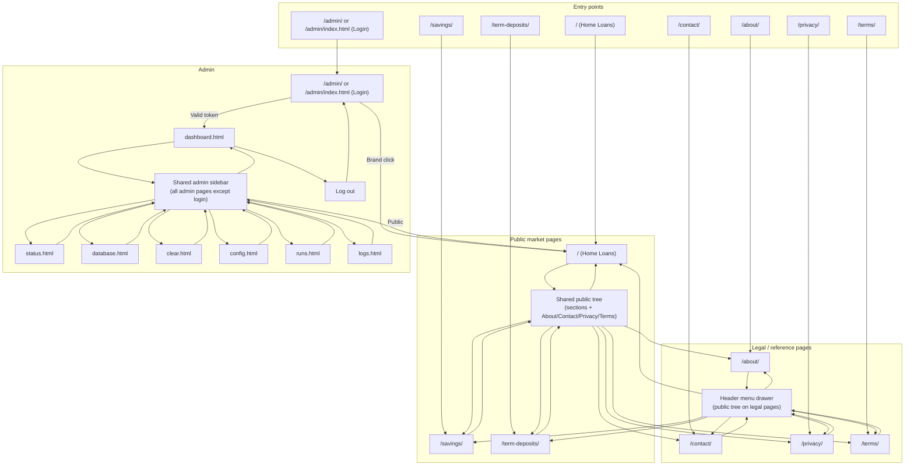

Public pages render a left nav tree with market sections plus About, Contact, Privacy, and Terms. Legal pages expose the same tree through the header menu drawer. All non-login admin pages render a shared sidebar with Dashboard, Status, Database, Clear, Config, Runs, Logs, and Public links; several pages also keep a page-local "Back to dashboard" link.

---

## 2. Global header actions

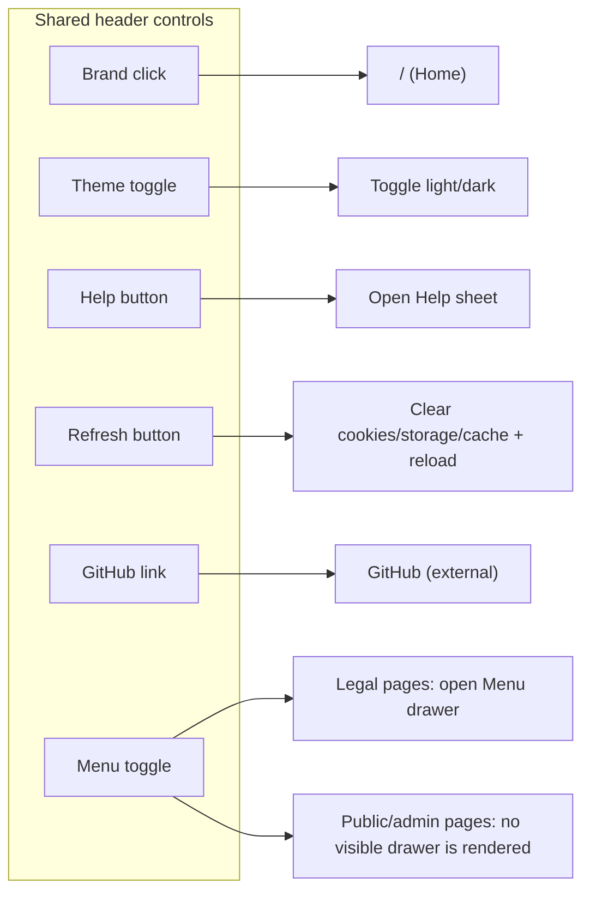

On mobile-host public/legal pages, an extra `DESK` / `MOB` switch is inserted into the header and a `Desktop site` / `Mobile site` link is added in the footer.

---

## 3. Public market page: anchored sections and tabbed panes

On `/`, `/savings/`, and `/term-deposits/` there are two different hash behaviors:

- `#chart`, `#ladder`, `#export`, and `#market-notes` scroll to anchored sections on the same page.
- `#table`, `#pivot`, `#history`, and `#changes` activate the tabbed bottom workspace. The active tab is also mirrored into the `?tab=` query string.

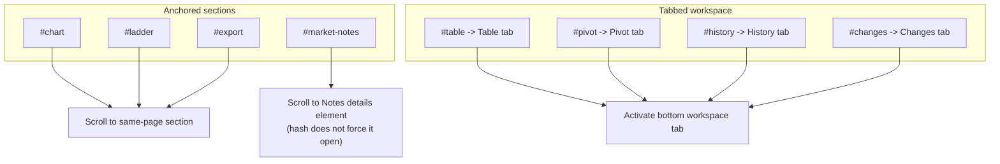

Charts, Leaders, Download, and Notes are reached from the left nav tree. Only Table, Pivot, History, and Changes are also switchable via the in-page tab buttons.

---

## 4. Modals and overlays: open -> actions -> outcome

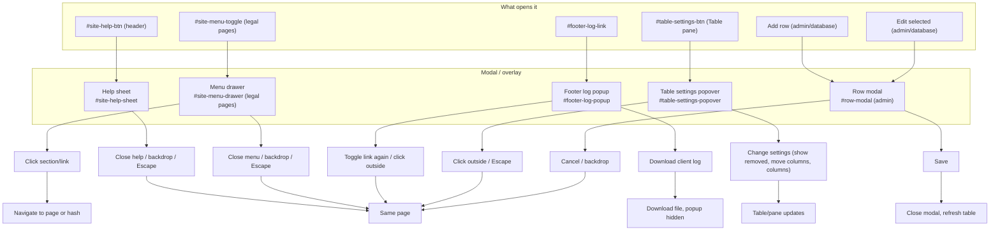

The header menu button is present across the shared frame, but the drawer itself is only rendered on legal pages.

---

## 5. Public market: filters and workspace actions

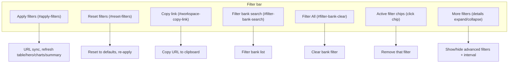

---

## 6. Public market: Table pane

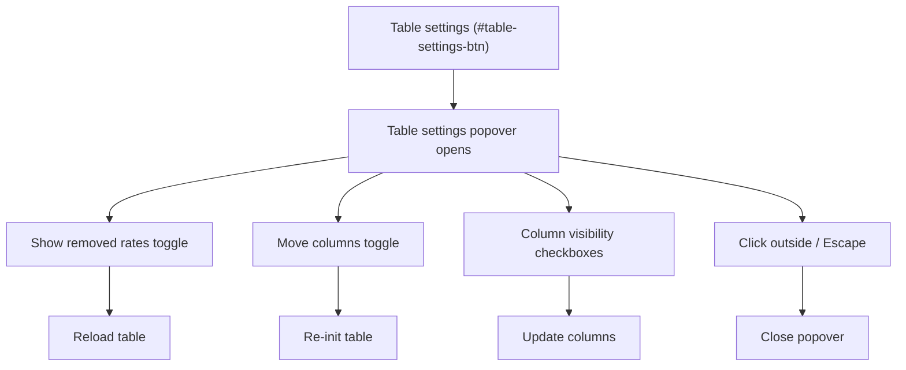

---

## 7. Public market: Export (Download pane)

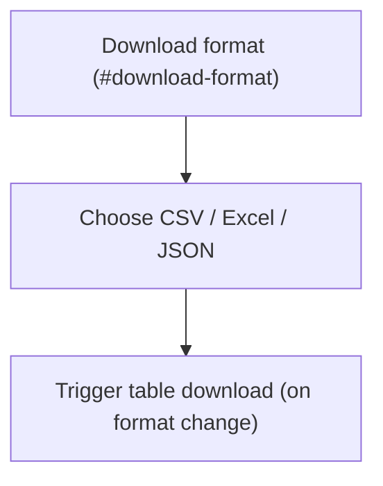

The main site has no separate "Download CSV" button; changing the format select triggers the download. Code supports an optional `#download-csv` button if present in alternate layouts.

---

## 8. Public market: Chart pane

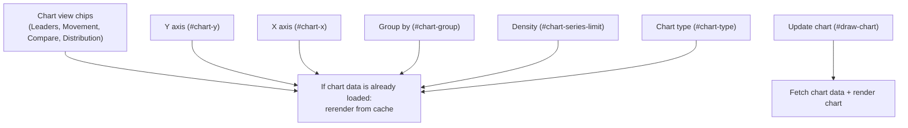

Chart summary and chart-point `Open` links go to `row.product_url` when present. The table's `URLs` column separately exposes `Product`, `Source`, and `Wayback` links when present.

---

## 9. Public market: Pivot pane

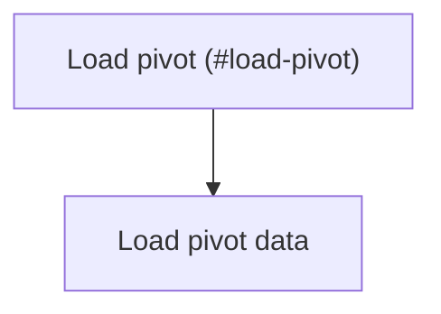

---

## 10. Public market: Ladder (Leaders) pane

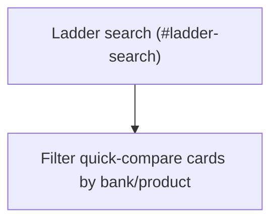

---

## 11. Public market: Notes and rate changes (expand/collapse)

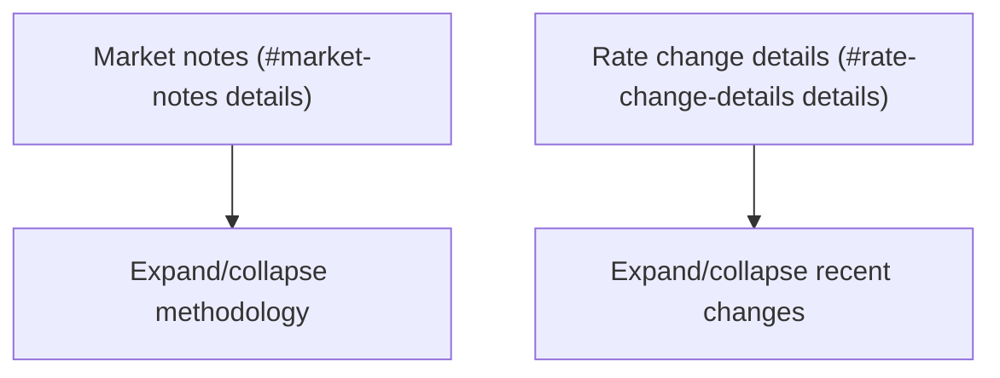

---

## 12. Footer (all pages with frame)

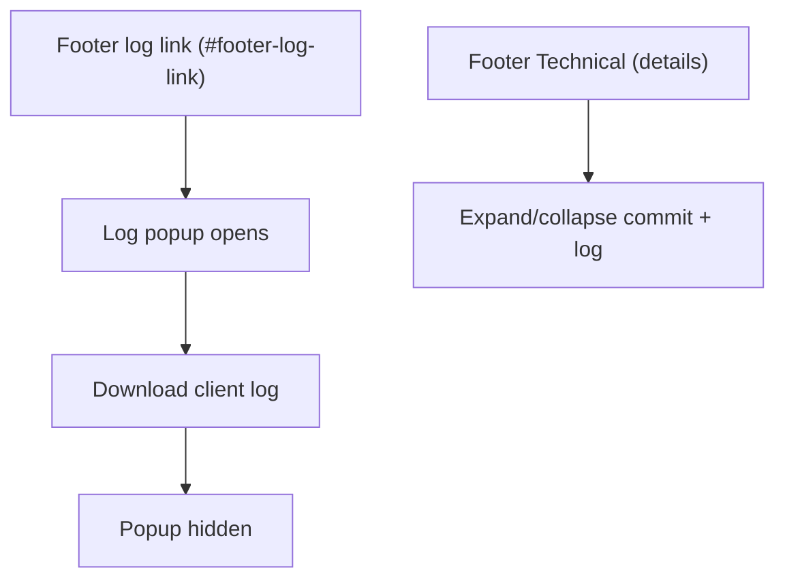

Footer links: About, Contact, Privacy, Terms (same as nav). On mobile-host public/legal pages, the host switch appears in both the header (`DESK` / `MOB`) and the footer (`Desktop site` / `Mobile site`).

---

## 13. Admin login

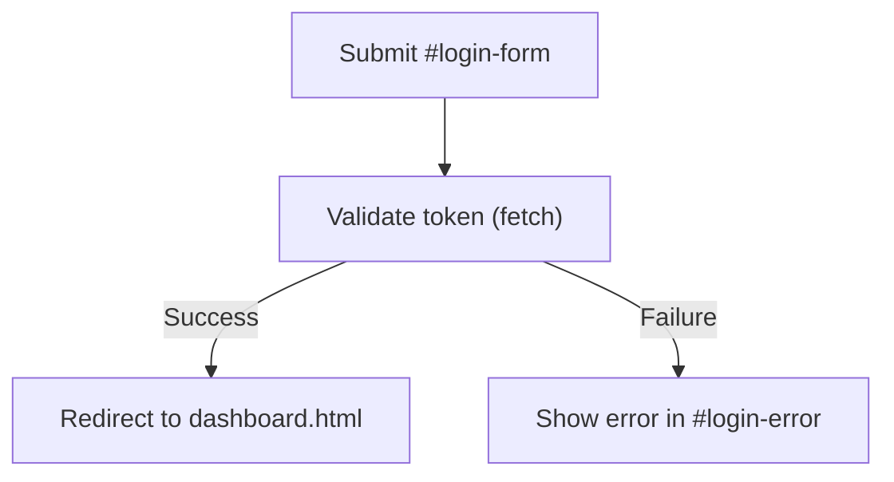

---

## 14. Admin dashboard

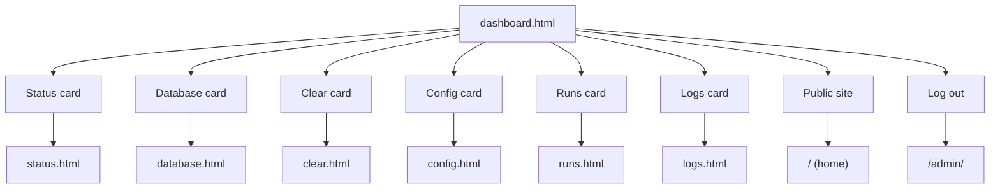

All non-login admin pages also expose the shared admin sidebar, so navigation is not limited to dashboard cards.

---

## 15. Admin database page

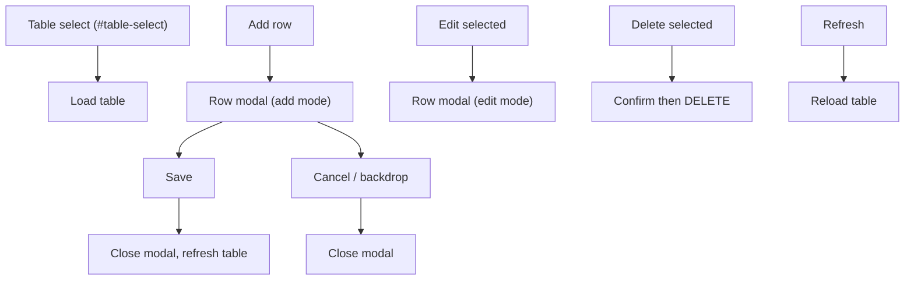

---

## 16. Admin clear page

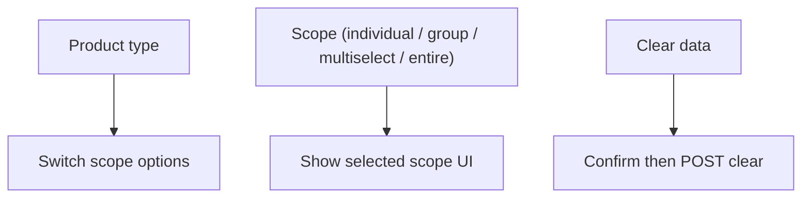

---

## 17. Admin config page

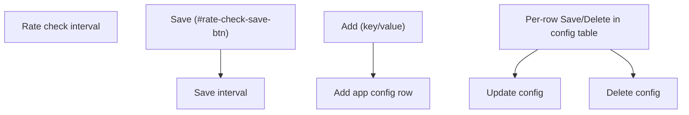

---

## 18. Admin runs page

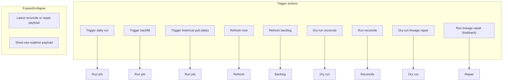

---

## 19. Admin status page

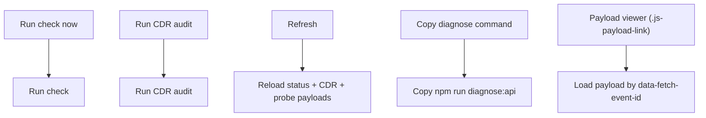

Status page also has quick links: Logs -> `logs.html`, Runs -> `runs.html`, Configuration -> `config.html`.

---

## 20. Admin logs page

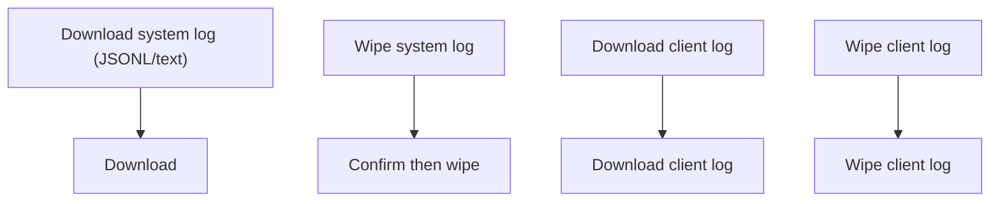

---

## 21. External / out-of-site

| Action | Result |
|--------|--------|
| GitHub (header / contact) | https://github.com/yanniedog/AustralianRates |
| Operator (privacy, contact, about, terms) | https://github.com/yanniedog |
| Mailto (privacy, contact, about, terms) | support@australianrates.com |
| Chart summary / chart-point `Open` links | `row.product_url` (lender page, new tab when present) |
| Table `URLs` column | `row.product_url`, `row.source_url`, and Wayback lookup when present |
| Noscript API links | /api/{section}-rates/... (new tab) |
| Footer deploy link | GitHub commit URL when available |

---

## 22. Tooltips and help

- Elements with `data-help`: hover/focus show tooltip; long-press on touch opens the Help sheet.
- Escape closes the tooltip, Help sheet, and legal-page menu drawer.

---

## Summary

- **Pages:** 3 public market (/, /savings/, /term-deposits/), 4 legal (about, contact, privacy, terms), 1 admin login, 7 admin pages (dashboard, status, database, clear, config, runs, logs).
- **Public hash behavior:** `#chart`, `#ladder`, `#export`, and `#market-notes` are anchored sections; `#table`, `#pivot`, `#history`, and `#changes` switch the tabbed bottom workspace.
- **Modals/overlays:** Help sheet (header), Menu drawer (legal pages only), Footer log popup, Table settings popover (Table pane), Row modal (admin database). Each has a concrete trigger and close/next action.
- **Admin:** Login -> dashboard -> shared sidebar across all 7 admin pages; dashboard also has `Log out`. Database has row add/edit modal; clear has scope + confirm; config has interval + key/value; runs has trigger buttons plus backlog/repair actions; logs has download/wipe.
- **Global:** Header (brand, theme, help, refresh, GitHub, menu), footer (legal links, technical details, log popup), and on mobile-host public/legal pages the DESK/MOB host switch in both header and footer.

Use this document together with the Mermaid diagrams to trace any user path from entry through clicks to the next page, pane, or overlay.
